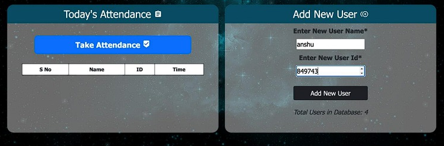
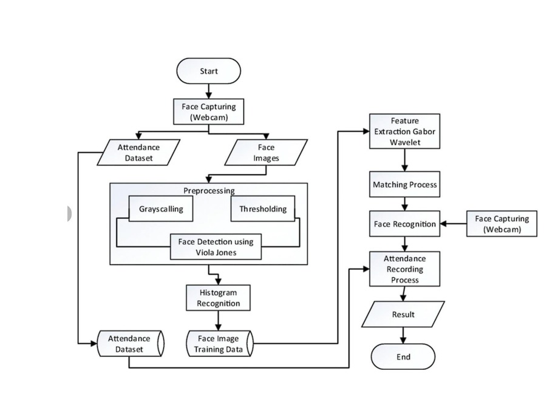
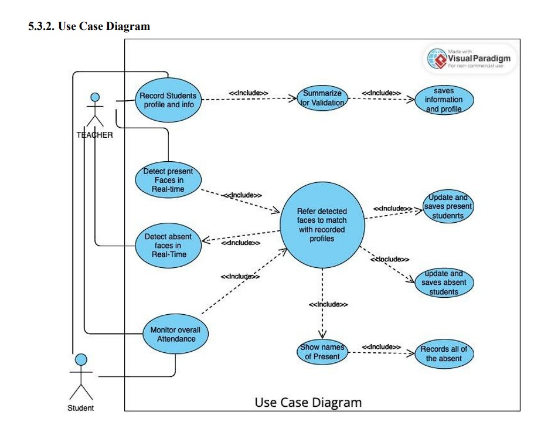

# 🎯 InstantAttend — Real-Time Face Recognition Attendance System

<p align="center">
  
  
  
  
  
</p>

> **InstantAttend** eliminates manual roll calls by automatically marking attendance using real-time face recognition — straight from your webcam, with a clean web dashboard.

---

## 📸 Demo



---

## ✨ Features

- 📷 **Live Webcam Face Detection** — Detects and identifies faces in real-time using OpenCV's Haar Cascade
- 🧠 **KNN-based Face Recognition** — Trains a K-Nearest Neighbours model on registered user faces
- 📋 **Auto Attendance Logging** — Marks attendance with name, ID, and timestamp into a daily CSV
- 🌐 **Flask Web Dashboard** — Clean browser UI to view today's attendance and manage users
- ➕ **Easy User Registration** — Capture 50 face samples per user and auto-retrain the model
- 📁 **Daily CSV Reports** — Attendance saved as `Attendance-MM_DD_YY.csv` for easy export

---

## 🏗️ System Architecture

```
Webcam Input
    │
    ▼
Face Detection (Haar Cascade)
    │
    ├──► Preprocessing (Grayscale + Resize to 50×50)
    │
    ├──► Feature Extraction → KNN Model Training (on registration)
    │
    └──► Face Identification → Attendance Recording → CSV + Web UI
```

| Data Architecture | Use Case Diagram |
|:---:|:---:|
|  |  |

---

## 🗂️ Project Structure

```
InstantAttend/
│
├── app.py                             # Flask backend — all routes & logic
├── requirements.txt                   # Python dependencies
├── README.md                          # You're reading it!
├── .gitignore                         # Files excluded from version control
├── screenshot.png                     # Dashboard preview
│
├── templates/
│   └── home.html                      # Main web dashboard (Jinja2)
│
├── static/
│   ├── faces/                         # Registered user face images (auto-created)
│   │   └── Name_ID/                   # 50 images per user
│   └── face_recognition_model.pkl     # Trained KNN model (auto-generated)
│
├── Attendance/
│   └── Attendance-MM_DD_YY.csv        # Daily attendance log (auto-created)
│
└── docs/
    ├── data_architecture.png
    └── use_case_diagram.png
```

---

## ⚙️ How It Works

### 1. Register a New User
- Enter name + ID in the web form → click **Add New User**
- Webcam opens and captures **50 face images** automatically
- Model **retrains** immediately with the new user included

### 2. Take Attendance
- Click **Take Attendance** → webcam opens
- System detects face → matches against trained KNN model
- Attendance marked with **name, roll number, and timestamp**
- Press `ESC` to close the webcam and view the updated table

### 3. View Records
- Dashboard shows today's attendance in real-time
- Raw CSV saved in `/Attendance/` folder for easy export

---

## 🚀 Getting Started

### Prerequisites
- Python 3.8+
- A working webcam

### Installation

```bash
# 1. Clone the repository
git clone https://github.com/BiplabaKrSamal/InstantAttend.git
cd InstantAttend

# 2. Install dependencies
pip install -r requirements.txt

# 3. Run the app
python app.py
```

### Open in Browser
```
http://127.0.0.1:5000
```

---

## 📊 Technology Stack

| Layer | Technology |
|---|---|
| Backend | Python, Flask |
| Face Detection | OpenCV (Haar Cascade Classifier) |
| Face Recognition | scikit-learn (KNN Classifier) |
| Frontend | HTML5, Bootstrap 5, Jinja2 |
| Data Storage | CSV (Pandas), Joblib (model persistence) |

---

## 🔮 Future Improvements

- [ ] Anti-spoofing / liveness detection
- [ ] Export attendance as Excel / PDF
- [ ] Email daily report to admin
- [ ] Multi-camera support
- [ ] Cloud database integration (Firebase / PostgreSQL)
- [ ] Deep learning upgrade (FaceNet / DeepFace) for higher accuracy

---

## 🤝 Contributing

Pull requests are welcome! For major changes, please open an issue first.

1. Fork the repo
2. Create your feature branch (`git checkout -b feature/AmazingFeature`)
3. Commit your changes (`git commit -m 'Add AmazingFeature'`)
4. Push to the branch (`git push origin feature/AmazingFeature`)
5. Open a Pull Request

---

## 📄 License

This project is licensed under the MIT License.

---

<p align="center">Made with ❤️ by <a href="https://github.com/BiplabaKrSamal">BiplabaKrSamal</a> | InstantAttend</p>
